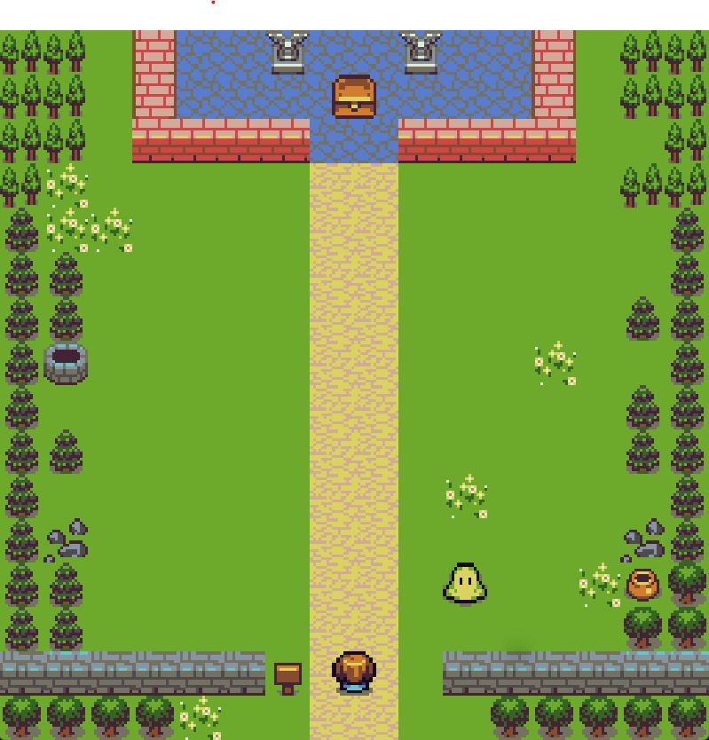

# TreasureGame

<h2>Project Overview:</h2>

TreasureGame is an engaging Python-based game developed utilizing the pygame library. This experience places users in the role of an adventurer, tasked with skillfully evading enemies and navigating the 
  dirt road to obtain the prized 
  treasure. Comprising a series of progressively challenging levels, this game presents challenges to triumphant players with more enemies and accelerated velocity, providing an increasingly thrilling and demanding gameplay experience.
  

  
  

<h2>How to Run on Local Computer: </h2>

  -Clone this repository.

  

  -In terminal, change directory path to project folder. Once changed, type "pythonw main.py" to run the game application.
  

  -A Game window should show up, enjoy the game!

